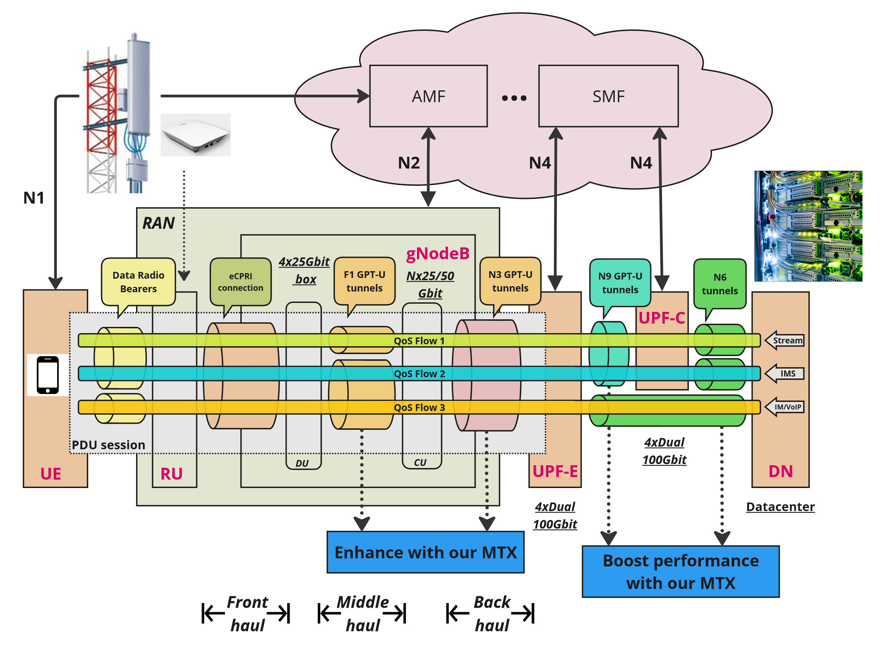
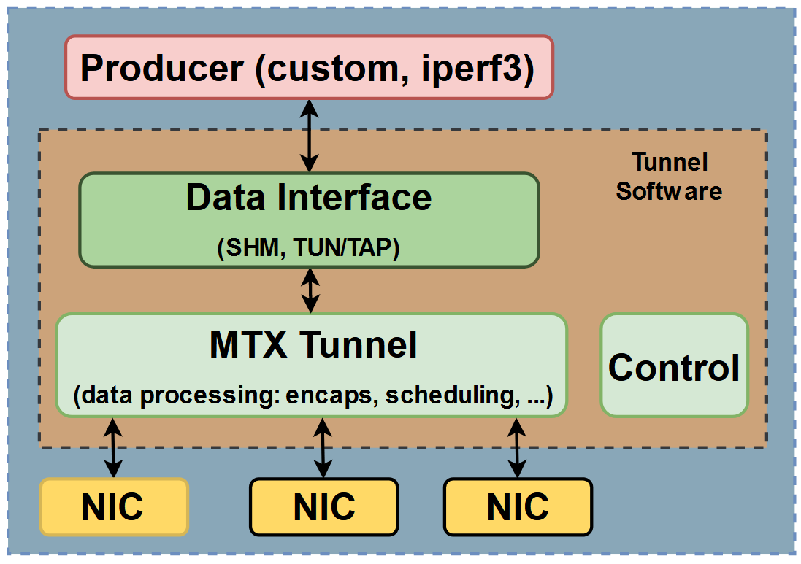
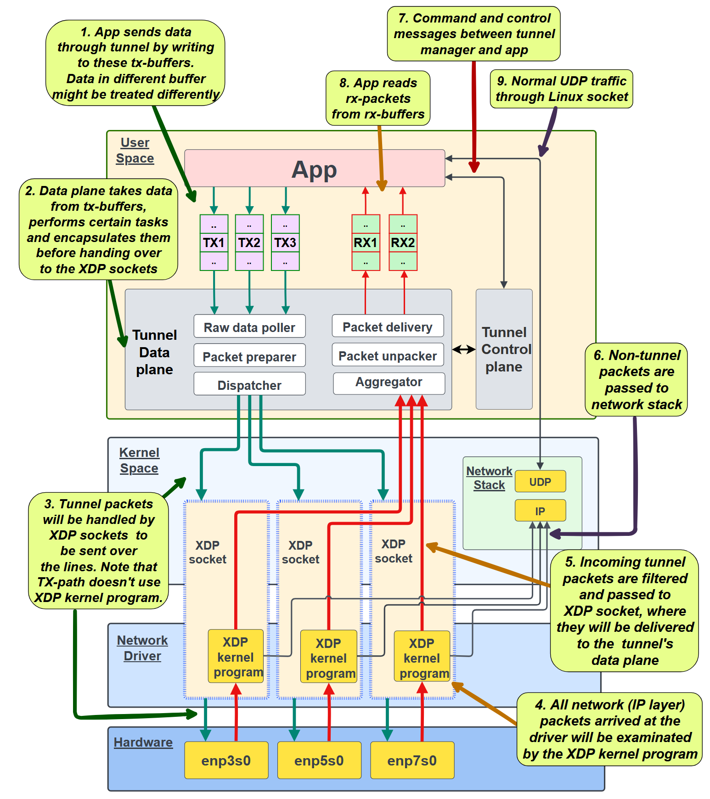

## Solution
The Load-balancer is implemented as an XDP program.
It intercepts all GTP packets, rewrite UDP header and lets the modified packets go.
This is because the LB and GWs are binded to the loopback interface.

After registration, contact data of PGWs are stored in ``pgw__instances_list_map`` array map. 

A quick test: `./runme test && ./ldtest -msgNum 100000 -msgRate 1000000 -sgwNum 10 -pgw-weights "11,23,37,41,53,73"`

<video src="demo.mp4" width="90%" controls></video>

## Known problems
- What Worked:
    - Max number of LB can be set with `MAX_LENGTH__PGW_INSTANCE`. Default is 4 to make reading from bpf maps less punished.
- Limitation:
    - LB doesn't reset/clear maps on startup. Use `./runme test` to remove and start the LB before running the Golang programs.
    - Edge cases. 
    - Currently no support for Dynamic PGW registering/deregistering/monitoring.
    - No userspace program for now.

- I am not sure about the practice of backing-up pointer and value of UDP/IP headers. I know that advancing a pointer makes that pointer proned to be rejected by the verifier, but it seems to be not always the case, at least from my observation.

## Quick run
The load-balancer is a XDP program (`kern__load_balancer.c`)
```bash
# Cleanup, compile and inject the Load-balancer
./runme test

# LB should be online now. Check its gateway database:
python3 parse_pgw_instances_map.py 
# ID: 0, Weight: 0, IP: 0.0.0.0, Port: 0, pkt_count: 0, Last Used: 0, last_seen: 0
# ID: 0, Weight: 0, IP: 0.0.0.0, Port: 0, pkt_count: 0, Last Used: 0, last_seen: 0
# ID: 0, Weight: 0, IP: 0.0.0.0, Port: 0, pkt_count: 0, Last Used: 0, last_seen: 0
# ID: 0, Weight: 0, IP: 0.0.0.0, Port: 0, pkt_count: 0, Last Used: 0, last_seen: 0

# Run the provided test programs
go build ./cmd/ldtest/... && ./ldtest
# ...
# 2025/08/01 01:16:58 weights [10 50 30]
# 2025/08/01 01:16:58 msgNums [112 555 333]
# 2025/08/01 01:16:58 Message distribution:
# 2025/08/01 01:16:58     Min: 11.1
# 2025/08/01 01:16:58     Max: 11.2

# Check how the packets are distributed, which gateway registered, which gateway was used last time ...
# Should run on another terminal.
python3 parse_pgw_instances_map.py 
# ID: 0, Weight: 10, IP: 127.0.0.1, Port: 42906, pkt_count: 112, Last Used: 303903384912259, last_seen: 9999
# ID: 1, Weight: 50, IP: 127.0.0.1, Port: 36560, pkt_count: 555, Last Used: 303903383361258, last_seen: 9999
# ID: 2, Weight: 30, IP: 127.0.0.1, Port: 49298, pkt_count: 333, Last Used: 303903382814758, last_seen: 9999
# ID: 0, Weight: 0, IP: 0.0.0.0, Port: 0, pkt_count: 0, Last Used: 0, last_seen: 0
```


## Related
My old graphic (2023) to demostrate how my XDP multipath tunnel can be used for boosting performance of a telco 5G setup. 
MTX was the objective of my master thesis, and is thought to be enhancing or acting as the infrastructure of GTP tunnels.
The MTX tunnel was designed to provide userspace applications a network tunnel to that can manage multiple flows over heterogeneous links.
The concept was proved to be feasible.

In this graphic, the tunnel is used for high-volumn traffic between DU-CU and UPF-DataNetwork, where many cheaper NICs can be cheaper and provide more reliable connection than a few high-end NIC.

<div style="align: left; text-align:center;">
    
    <span style="display:block;"></span>
</div>

Tunnel traffic consisted of UDP encapsulation packets.
<div style="align: left; text-align:center;">
    
    <span style="display:block;"></span>
</div>


More details of the design. The tunnel bypasses most of the network stack.
<div style="align: left; text-align:center;">
    
    <span style="display:block;"></span>
</div>


### XDP program
OS: Ubuntu 24 LTS, kernel 6.11.

Dependencies: https://github.com/xdp-project/xdp-tutorial/blob/main/setup_dependencies.org

Compile:
```bash
clang -O2 -g -Wall -target bpf -c kern__load_balancer.c -o kern__load_balancer.o
```

Inject:
```bash
sudo ip link set dev lo xdp obj kern__load_balancer.o sec xdp
# check: sudo ip link show dev lo
```

Cleanup:
```bash
# Remove:
sudo ip link set dev lo xdp off
# Remove pinned maps:
sudo rm /sys/fs/bpf/tc/globals/pgw__udp_count_map /sys/fs/bpf/tc/globals/pgw__instances_list_map
```

### Mnitor the config map from user-space
```bash
# raw
sudo bpftool map dump pinned /sys/fs/bpf/tc/globals/pgw__instances_list_map
# [{
#         "key": 0,
#         "value": {
#             "id": 0,
#             "weight": 167772160,
#             "ipv4_addr": 16777343,
#             "port": 60873,
#             "reserved": 0,
#             "pkt_count": 112,
#             "last_used": 299367152691806,
#             "last_seen": 9999
#         }
#     },{
#         ...

# or use a python script
python3 parse_pgw_instances_map.py 
# ID: 0, Weight: 10, IP: 127.0.0.1, Port: 51693, pkt_count: 112, Last Used: 299367152691806, last_seen: 9999
# ID: 1, Weight: 50, IP: 127.0.0.1, Port: 40879, pkt_count: 555, Last Used: 299367150548704, last_seen: 9999
# ID: 2, Weight: 30, IP: 127.0.0.1, Port: 42112, pkt_count: 333, Last Used: 299367150010104, last_seen: 9999
# ID: 0, Weight: 0, IP: 0.0.0.0, Port: 0, pkt_count: 0, Last Used: 0, last_seen: 0
```

DUMP

```bash

clang -O2 -g -Wall -target bpf -c kern__load_balancer.c -o kern__load_balancer.o

sudo ip link set dev lo xdp obj kern__load_balancer.o sec xdp
# view bpf log
sudo cat /sys/kernel/debug/tracing/trace_pipe

# view map
sudo bpftool map lookup id 31 key hex 00 00 00 00 >> map.json

sudo python3 get_counts.py
sudo nc -ul 2152

./ldtest -msgRate 1000

sudo ip link show dev lo
sudo ip link set dev lo xdp off
# list all xdp programs
sudo bpftool prog
sudo bpftool prog detach id <ID> dev lo
sudo bpftool map show


# pinned map
sudo rm /sys/fs/bpf/tc/globals/pgw__udp_count_map /sys/fs/bpf/tc/globals/pgw__instances_list_map
sudo rm /sys/fs/bpf/tc/globals/pgw__instances_list_map
```